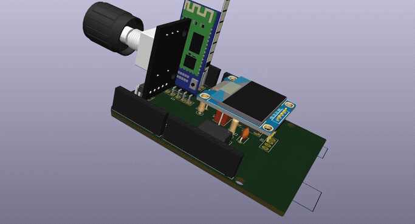
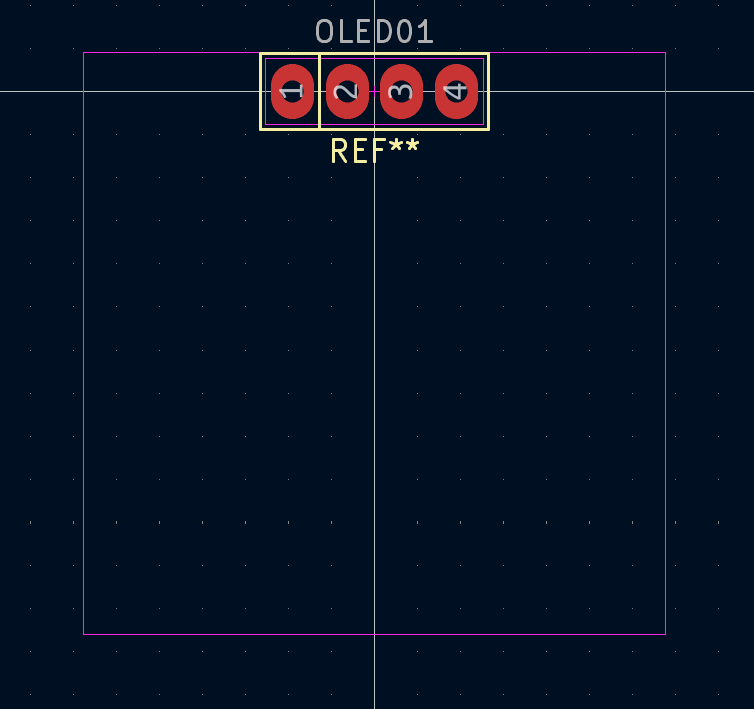

# 4GP 2024/2025 - Projet de capteur *low-tech en graphite* - Par Esther BOIRON et Margot HERNANDEZ
-------------------------

## Table des matières
* [Contacts](#contacts) 
* [Contexte](#contexte) 
* [Livrable](#livrable) 
* [Matériel requis](#matériel-requis)  
* [1. Simulation électronique sous LTSpice](#1-simulation-électronique-sous-ltspice)  
* [2. Design du PCB sous Kicad](#2-design-du-pcb-sous-kicad)  
* [3. Code sur Arduino](#3-code-sur-arduino)  
* [4. Application Android](#4-application-android)  
* [5. Réalisation du shield](#5-réalisation-du-shield)  
* [6. Banc de tests](#6-banc-de-tests)  
* [7. Résultats et discussion](#7-résultats-et-discussion)  
* [8. Datasheet du capteur](#8-datasheet-du-capteur) 
* [Conclusion](#conclusion)
------------
## Contacts
Esther BOIRON : eboiron@insa-toulouse.fr  
Margot HERNANDEZ : mhernan2@insa-toulouse.fr

------------
## Contexte
Dans le cadre de l’UF de quatrième année du département Génie Physique intitulée *Du capteur au banc de test*, nous avons développé et évalué la performance d’un capteur low-tech en graphite. Il est constitué d’un simple morceau de papier recouvert d’une trace de crayon à papier, formant une fine couche de graphite. Lorsque le papier se déforme, le nombre de particules de graphite reliées varie, entraînant une modification de la résistance du capteur. Ce phénomène permet ainsi de mesurer la déformation, à la manière d’une jauge de contrainte traditionnelle.

Ce travail s’appuie sur les recherches de scientifiques américains (Cheng-Wei Lin*, Zhibo Zhao*, Jaemyung Kim & Jiaxing Huang), qui ont publié en 2014 l’article [Pencil Drawn Strain Gauges and Chemiresistors on Paper](https://www.researchgate.net/publication/259846610_Pencil_Drawn_Strain_Gauges_and_Chemiresistors_on_Paper).

Vous trouverez ici l’ensemble des réalisations effectuées dans le cadre de ce projet : simulations électroniques, conception du PCB, programmation Arduino, développement d’une application Android et élaboration d’une datasheet.

------------
## Livrable
Plusieurs livrables sont attendus :

✓ Un shield PCB connecté à une carte Arduino UNO, intégrant : un capteur en graphite, un montage amplificateur transimpédance, un module Bluetooth, un écran OLED, un encodeur rotatif, un potentiomètre numérique ainsi qu'un capteur de flexion commercial (flex sensor). 

✓ Un code Arduino assurant le contrôle de l’ensemble des composants et la réalisation des mesures. 

✓ Une application Android permettant de visualiser les mesures depuis un smartphone. 

✓ Un code Arduino dédié aux essais du capteur sur le banc de test. 

✓ Une datasheet détaillant les caractéristiques du capteur en graphite. 

------------
## Matériel requis
Afin de réaliser notre dispositif, voici la liste des composants nécessaires :

Pour le montage amplificateur transimpédance :

* Des résistances : 1 de 1 kΩ, 1 de 10 kΩ, 2 de 100 kΩ
* Un potentiomètre numérique : ici, le MCP41050
* Des condensateurs : trois de 100 nF et un de 1 μF
* Un amplificateur opérationnel : ici, le LTC1050

Pour le reste du dispositif :
* Un module Bluetooth : ici, le HC05
* Un écran OLED : ici, un écran de dimensions 128x64
* Un encodeur rotatif
* Un capteur de flexion (flex sensor)
* Une résistance de 33 kΩ
* Une carte Arduino UNO
------------
## 1. Simulation électronique sous LTSpice
Notre objectif est de mesurer la résistance de notre capteur en graphite puis de retrouver sa déformation par une relation de proportionalité. Nous savons que la résistance est de l’ordre du gigaohm (GΩ). Sous une tension de 5V, correspondant à celle délivrée par l’Arduino, le capteur délivre un courant extrêmement faible, de l’ordre de quelques nanoampères (nA). Cette mesure ne peut donc pas se faire directement : nous devons amplifier le signal. De plus, nous utilisons l'Arduino Uno et ce microcontrôleur ne peut mesurer que des tensions (cf [datasheet](https://docs.arduino.cc/resources/datasheets/A000066-datasheet.pdf)). Nous avons donc besoin d'un montage amplificateur transimpédance pour convertir notre courant en une tension exploitable par les entrées analogiques de l'Arduino. Pour cela, nous avons choisi l’amplificateur opérationnel  LTC1050.

Associé à cet amplificateur, nous réalisons un montage structuré en trois zones principales qui correspondent à des filtres pour améliorer la qualité du signal mesuré :

* Filtrage en entrée de l'amplificateur (R1 et C1) : un filtre passe-bas passif de fréquence de coupure de 16 Hz qui permet de filtrer le bruit en courant sur le signal d'entrée
* Filtrage couplé à l'amplificateur (R3 et C4) : un filtre passe-bas actif de fréquence de coupure de 1.6 Hz qui permet de filtrer la composante 50 Hz issue du réseau électrique 
* Filtrage à la sortie de l'amplificateur (R6 et C2) : filtre passe bas passif de fréquence de coupure de 1.6 kHz qui permet de réduire le bruit créé lors du traitement du signal (bruits des alimentations, de l’horloge…)

  

Afin de pouvoir ajuster dynamiquement le gain de l’amplificateur en fonction des besoins de mesure, la résistance R2 sera remplacée ultérieurement par un potentiomètre digital.

Nous avons validé notre montage sur LTSpice en deux étapes :

Tout d'abord, nous avons réalisé une première simulation afin de s’assurer que l’amplification fonctionne correctement. L’image ci-dessous montre que le signal est bien amplifié à 1 V : le signal a donc une valeur suffisante pour être interprété par l’Arduino.

  

Ensuite, nous avons réalisé une seconde simulation afin d'observer la réponse à un courant alternatif afin de vérifier l’efficacité du filtrage. Les variations de la phase observées sur le graphe ci-dessous illustrent le passage du signal à travers les trois filtres successifs.

  

------------
## 2. Design du PCB sous Kicad
Après avoir réalisé les simulations sur LTSpice, nous avons conçu notre PCB à l’aide du logiciel KiCad. Pour cela, nous sommes parties du schéma du montage décrit précédemment, auquel nous avons apporté quelques modifications.
Parmi ces modifications, nous avons notamment remplacé la résistance R2 par un potentiomètre numérique permettant un réglage précis du gain de l’amplificateur, tout en évitant la saturation. Nous avons également ajouté plusieurs composants afin d’améliorer les fonctionnalités de notre système et de comparer les résultats obtenus :
* Le module Bluetooth HC-05 : permet d'assurer la communication entre le PCB et un smartphone via une application Android.
* Un écran OLED : utilisé pour afficher différents menus en temps réel.
* Un encodeur rotatif : contrôle la navigation entre les différentes options affichées sur l’écran OLED.
* Un flex sensor : utilisé pour comparer les mesures du capteur en graphite avec celles d’un capteur commercial lors des tests finaux

__Création des bibliothèques et symboles__  

La première étape de la conception a consisté à créer notre propre bibliothèque de symboles pour les composants spécifiques du montage. Nous avons dessiné les symboles correspondants aux différents composants utilisés. L’image ci-dessous illustre, par exemple, le symbole de l’écran OLED.

  

__Création des empreintes des composants__

La deuxième étape a consisté à créer les empreintes des composants. Cette phase est essentielle pour garantir une bonne intégration des composants sur le circuit imprimé. Pour cela, nous avons pris en compte la dimension physique des composants ainsi que le diamètre des trous. L’image ci-dessous illustre l’empreinte de l’écran OLED.

  

Afin d’obtenir une visualisation 3D réaliste de notre PCB final, nous avons associé à chaque empreinte une modélisation 3D du composant correspondant. Cette étape permet de vérifier l’agencement des composants, d’anticiper d’éventuels problèmes d’encombrement et d’optimiser le design du circuit imprimé.
Les modèles 3D utilisés ont été récupérés sur la plateforme GrabCAD, qui propose une large bibliothèque de fichiers compatibles avec KiCad.
L’image ci-dessous illustre la modélisation 3D de l’écran OLED.

  
  

__Création de la schématique électrique__

Après avoir défini les empreintes et les modèles 3D des composants, nous avons procédé à la création de la schématique électrique du montage. Lors de cette étape, nous avons opté pour un modèle basé sur l’Arduino UNO afin de garantir la correspondance correcte des pins de connexion avec l’Arduino.

  

__Disposition des composants sur le PCB__

La dernière étape de notre conception a été l’agencement des composants sur le PCB. L’objectif principal est d’optimiser leur disposition en tenant compte des connexions électriques tout en minimisant l’utilisation de vias. Les images ci-dessous présentent le résultat final de notre PCB, ainsi que sa vue en 3D, permettant de visualiser l’implantation des composants.

  
  

------------
## 3. Code sur Arduino
Notre code Arduino, conçu pour contrôler les composants implémentés et effectuer les mesures à l’aide du capteur en graphite et du capteur commercial, a été développé sous [Arduino IDE 2.3.4](https://www.arduino.cc/en/software/).  

Nous avons utilisé les bibliothèques *SoftwareSerial.h* pour la communication Bluetooth et *Adafruit_SSD1306.h* pour l'affichage sur écran OLED. Étant donné que notre programme utilise une part importante de la mémoire RAM, nous avons rencontré des problèmes de stockage : le programme ne se lançait pas et aucune information n'était affichée dans l'IDE lors du téléversement. Pour remédier à cela, nous avons intégré la bibliothèque *avr/pgmspace.h*, qui permet de stocker des données en mémoire flash afin de libérer de l’espace dans la RAM. 

Nous avons réalise un premier programme qui permet de calibrer le potentiomètre digitale afin d’optimiser les mesures réalisées par les deux capteurs. Le programme principal propose une interface à l’écran avec quatre menus, accessibles en tournant l’encodeur rotatif. La sélection d’un menu se fait en appuyant sur le bouton intégré à l’encodeur. Ce bouton permet également de revenir au menu principal lorsque nous sommes dans un sous-menu.  

Les sous-menus disponibles sont les suivants :
* Menu Informations : fournit des détails sur le projet.
* Menu Application : permet d'établir une communication avec l’application Android via le module Bluetooth.
* Menu Capteur Graphite : affiche en temps réel la valeur de résistance mesurée par le capteur en graphite.
* Menu Capteur Commercial : affiche en temps réel la valeur de résistance mesurée par le capteur commercial. 

Les codes complets sont disponibles dans le dossier [Arduino](Arduino).

Ci-dessous, une vidéo illustrant les différents menus accessibles sur l’écran OLED :

------------
## 4. Application Android
Nous avons également réalisé une application Android développé sous [MIT App Inventor](https://appinventor.mit.edu/).

  

Cette application reçoit les données transmises par le module Bluetooth HC-05 lorsque l’utilisateur est dans le mode « application » de l’écran OLED accessible via l’encodeur rotatif. 

Deux modes sont disponibles à partir d’un listpicker : le mode « capteur graphite » et le mode « capteur commercial ». Dans chacun de ces modes, la valeur de la résistance du capteur est affichée en temps réel. En cliquant sur le bouton « start », l’application passe en mode acquisition et trace l’évolution de la résistance sur un graphique en fonction du temps. L’acquisition est arrêtée en cliquant sur « pause ». Le bouton refresh permet de réinitialiser le graphique en effaçant les données précédemment tracées.

L’application ainsi que son code source sont disponibles dans le répertoire [Application](Application).

------------
## 5. Réalisation du shield
Après la conception et la validation du PCB, nous avons procédé à la fabrication physique du shield en suivant plusieurs étapes :
* Vérification du PCB sur KiCad : utilisation de l’outil Contrôle des règles de conception (DRC) pour s’assurer qu’il n’y a pas d’erreur dans les connexions et les espacements des pistes.
* Impression du masque de gravure sur un papier transparent 
* Insolation UV d’une plaquette d’époxy recouverte d’une couche de cuivre et de résine photosensible : la plaquette est exposée aux UV à travers le masque
* Révélation du motif : la plaquette est immergée dans un révélateur (soude très diluée) afin d'éliminer la résine exposée aux UV et laisser les pistes de cuivre protégées 
* Gravure des pistes : la plaquette est immergée dans un bain de perchlorure de fer pour graver les pistes
* Nettoyage de la plaquette : utilisation d'acétone pour retirer les résidus de résine 
* Perçage des trous et soudure des composants sur le PCB

  
  
  
  
  

------------
## 6. Banc de tests
Le but de ce banc de test est de déterminer la sensibilité du capteur, d’étudier son évolution, puis de la comparer à celle d’un capteur commercial de type "Flex-Sensor". Pour cela, nous avons utilisé le banc de test suivant, composé de six cercles dont les diamètres varient de 1.4 à 3.9 cm. Ce banc a été fabriqué à l’aide d’une imprimante 3D.

  

Ce banc de test permet de mesurer la variation de résistance relative ΔR/R0 en fonction de la déformation ε, définie par la relation ε =e/D où e est l'épaisseur du capteur (ici celle de la feuille, soit 0,2 mm) et D le diamètre du cercle considéré.  

Les tests ont été réalisés en tension et en compression sur des capteurs à base de graphite.

  

Nous avons réalisé les tests avec des capteurs recouverts de trois types de graphite différents : d'un crayon 6B, 4B, B et HB. Nous avons utiliser de la pate à fixe pour maintenir les capteurs en papier sur le banc de test sans avoir à toucher lors des mesures.  

Ces capteurs ont été fabriqués à l’aide de quatre types de graphite différents : des crayons 6B, 4B, B et HB. Pour maintenir les capteurs en papier sur le banc de test sans les toucher pendant les mesures, nous avons utilisé de la pâte à fixe.

  

------------
## 7. Résultats et discussion
Les courbes ci-dessous illustrent les variations de la résistance en fonction de la déformation, en tension et en compression, pour des capteurs en graphite réalisés avec différents types de crayons. 

  
  

La courbe ci-dessous présente le comportement du capteur commercial pour une déformation en tension, le flex sensor ne supportant pas une déformation en compression. 

  

On remarque que lorsque le capteur graphite est soumis à une déformation en tension, la résistance du capteur augmente. Ce phénomène est attendu : en tension, les distances interatomiques entre les atomes de carbone s’allongent, ce qui freine le passage du courant et augmente la résistance. A l’inverse, lors d’une compression, les atomes se rapprochent, facilitant le passage du courant et donc la résistance diminue.  

Les résultats montrent aussi que le type de crayon utilisé influence fortement les valeurs de résistance mesurées. Plus un crayon est gras (comme le 6B ou le 4B), plus il dépose de carbone sur le papier, ce qui réduit la résistance globale du capteur. Les courbes indiquent également que plus un crayon est gras, moins la variation relative de la résistance est importante. Autrement dit, les capteurs réalisés avec des crayons plus gras sont moins sensibles à la déformation.  

Ces résultats expérimentaux permettent de conclure que le capteur commercial est globalement plus sensible à la déformation que les capteurs en graphite. De plus, il présente une bien meilleure robustesse : les capteurs en graphite sont fragiles et le simple fait de toucher leur surface peut altérer le dépôt de graphite, faussant les mesures qui suivent, il faut les manipuler avec beaucoup de précaution. Leur durée de vie est aussi limitée, en particulier lorsqu’ils sont soumis à de fortes déformations. Entre chaque série de tests (tension ou compression), il a été nécessaire de fabriquer un nouveau capteur, car la résistance au repos changeait significativement après les premières déformations.  

Il est important de noter que plusieurs facteurs peuvent influencer les résultats, notamment la quantité de graphite déposée sur le papier, qui est difficile à maîtriser précisément. Cette variabilité peut entraîner des écarts non négligeables dans les mesures. Une amélioration possible consisterait à développer un procédé de dépôt de graphite d’une quantité fixe et reproductible, ainsi qu’un système de protection de la face du capteur contenant le trait de graphite pour éviter la perte de matière au contact.  

Le capteur commercial s'avère donc plus précis, plus résistant, et mieux adapté à des mesures répétées ou à des déformations importantes. En revanche, les capteurs en graphite présentent l’avantage de pouvoir mesurer des déformations en compression, contrairement au flex-sensor.

------------
## 8. Datasheet du capteur
Vous pouvez trouver la datasheet du capteur [ici](Datasheet.pdf).

------------
## Conclusion
Ce projet a été très enrichissant, nous offrant une immersion concrète dans le métier d’ingénieur, avec des tâches variées allant des phases de simulation jusqu’à la rédaction d’une datasheet. Nous avons apprécié la diversité des compétences mobilisées : conception électronique, fabrication, expérimentation et analyse, ainsi que la satisfaction de voir aboutir un produit final fonctionnel.  

Le capteur que nous avons développé est opérationnel et les tests réalisés mettent en évidence des tendances globalement cohérentes avec les principes physiques attendus. Ces résultats montrent qu’un simple matériau comme le graphite peut être exploité pour détecter des déformations mécaniques.  

Cependant, les conditions expérimentales mises en œuvre restent assez artisanales et peu reproductibles. La précision des mesures est fortement influencée par des paramètres difficilement maîtrisables, tels que la quantité de graphite déposée ou la qualité du contact des pinces sur les traits de crayon du capteur. De plus, la fragilité du capteur et sa très faible durée de vie rendent son industrialisation peu envisageable.

     

  

